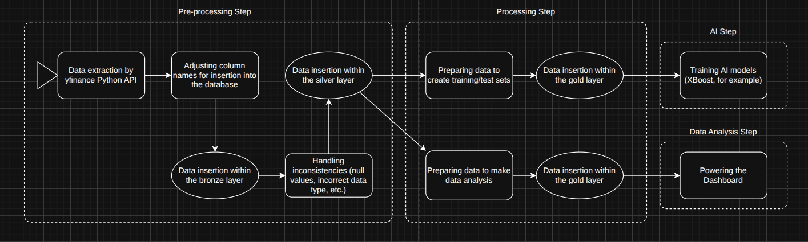

# Architecture

### Overview
Brief description of what the system does and its responsibilities

## Stack
- Python 3.12
- PostgreSQL 15
- Docker

## Folder Structure
- `docker/` — Docker configurations (compose, env, etc.)
- `src/`
  - `alphastream/`
    - `database/` — database connection and base modules
    - `migrations/` — schema definitions and table creation
    - `pipelines/` — main data flow and processing logic
    - `queries/` — database query definitions
    - `utils/` — shared helper functions and reusable modules

## Data Flow
API → ingestion ↔ pre-processing → database (for now)

## Diagram
